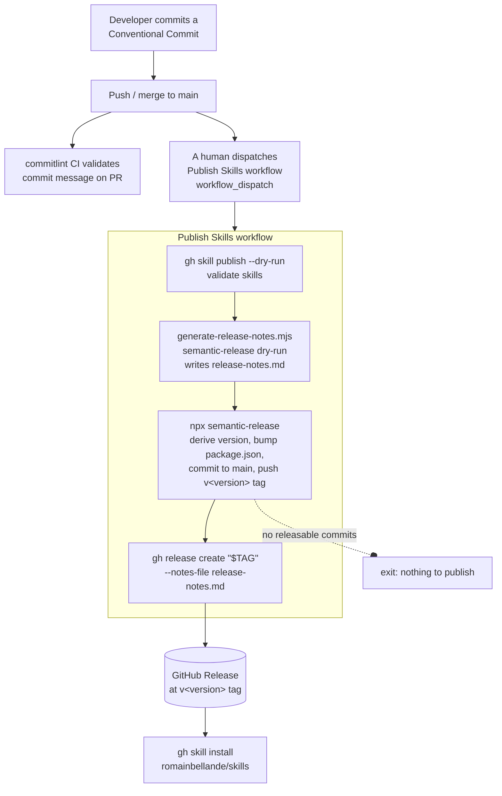

# Release & skill publishing pipeline

How this repository versions, tags, and publishes agent skills. The domain terms are defined in [`CONTEXT.md`](../CONTEXT.md); the design decisions behind this pipeline live in [`docs/adr/0001-semantic-release.md`](adr/0001-semantic-release.md).

## Overview

A single manual workflow (`.github/workflows/publish-skills.yml`) does everything:

1. **Validate** — `gh skill publish --dry-run` checks the skills against the Agent Skills specification.
2. **Version & tag** — `semantic-release` derives the next version from Conventional Commits since the last tag, bumps `package.json`/`package-lock.json`, commits that back to `main` (`[skip ci]`), and pushes a `v<version>` git tag.
3. **Publish** — `gh release create` creates the GitHub Release at that tag. This release is what `gh skill install romainbellande/skills` consumes.



## Why `gh release create` instead of `gh skill publish`

`gh skill publish` wants to own the version tag. When given `--tag`, it refuses to publish onto a tag that already exists:

```
Pushing main to origin...
✓ Pushed main to origin
tag v1.0.3 already exists; choose a different version
```

semantic-release always creates and pushes the `v<version>` tag first, so `gh skill publish --tag "$TAG"` failed on every release. The two tools cannot both own the tag.

The resolution: **semantic-release owns versioning and tagging; `gh release create` owns the release; `gh skill publish` is a validation gate only** (`--dry-run`, it never pushes tags or creates releases).

## Release notes

semantic-release generates release notes but only prints them in dry-run mode, and even then through a terminal renderer. `.github/scripts/generate-release-notes.mjs` calls semantic-release's own `run({ dryRun: true })` before the real run and writes the raw markdown of `nextRelease.notes` to `release-notes.md`, which the publish step feeds to `gh release create --notes-file`.

The dry-run is read-only — it analyzes commits and generates notes but creates no tag and pushes nothing. It runs before `npx semantic-release` because once the real run has tagged `HEAD`, a second run sees no pending release.

## Authentication

The workflow authenticates with a **GitHub App** via `actions/create-github-app-token`, because the default `GITHUB_TOKEN` cannot bypass the `main` branch-protection rule that the bump commit and tag push must land on.

Required GitHub configuration:

| Where | What |
| --- | --- |
| GitHub App | Installed on the `romainbellande/skills` repository with `Contents: read & write` |
| Branch protection | The app is added under "Allow specified actors to bypass required rules" on `main` |
| Repo variable | `RELEASE_APP_ID` (the app's ID) |
| Repo secret | `RELEASE_APP_PRIVATE_KEY` (the app's private key PEM) |

## Running a release

1. Merge changes to `main` using Conventional Commits (`feat:` → minor, `fix:`/`perf:` → patch, `BREAKING CHANGE` → major).
2. In the Actions tab, dispatch the **Publish Skills** workflow manually (`workflow_dispatch`).
3. The workflow bumps the version, tags it, and publishes the release. If nothing since the last tag warrants a version change, it exits without publishing.

There is deliberately no automatic release on push — publishing stays a manual, deliberate action.
