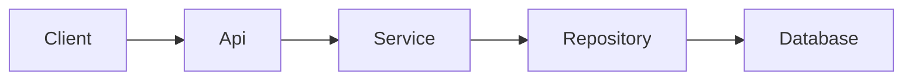

# Document Existing Project

Produce an evidence-based documentation set that gives a new contributor a navigable map of the project.

## 1. Establish the documentation contract

1. Identify the intended readers, documentation location, and requested depth.
2. Inspect existing documentation and repository instructions before proposing files.
3. Preserve established terminology and document conventions.

Completion criterion: the audience, scope, output location, and conventions are explicit.

## 2. Build an evidence map

1. Inspect the repository tree, entry points, build and dependency manifests, configuration, tests, and the primary runtime paths.
2. Trace important flows from an external trigger through orchestration, domain logic, and persistence or external services.
3. Separate verified facts from assumptions; resolve material assumptions in the code or call them out as gaps.
4. Record source paths for every architectural claim so the documentation remains auditable.

Completion criterion: every documented component and relationship is supported by a source path or clearly labeled as an assumption.

## 3. Write the Markdown set

Use descriptive headings, relative links, and short sections. Prefer the existing documentation structure; otherwise create only the documents needed by the evidence map.

Cover the applicable topics:

- Project purpose, boundaries, and primary users.
- Local setup, common commands, configuration, and verification.
- Repository map and responsibility of key directories.
- Runtime architecture, component responsibilities, and dependencies.
- Important request, event, data, or deployment flows.
- Extension points, operational concerns, constraints, and known gaps.

Keep reference material close to its use. Link to source files rather than copying implementation details that will drift.

Completion criterion: a new contributor can locate the entry points, run the project, understand its main flow, and identify where to make a change.

## 4. Add Mermaid diagrams

Use Mermaid only when it makes a relationship or flow clearer than prose.

1. Choose the smallest fitting diagram type: `flowchart` for control or dependency flow, `sequenceDiagram` for interactions over time, `classDiagram` for stable domain relationships, and `erDiagram` for persisted data.
2. Keep node labels short and use identifiers without spaces or punctuation.
3. Place each diagram beside the explanation it supports and state what it deliberately omits.
4. Ensure every edge reflects the evidence map; do not infer implementation details from names alone.

Example:

Completion criterion: each diagram renders in a Mermaid-compatible Markdown viewer and agrees with the surrounding prose.

## 5. Verify the result

1. Check all internal links, commands, paths, headings, code fences, and Mermaid fences.
2. Compare documentation claims and diagrams against the current code after writing.
3. State what was documented, what was intentionally excluded, and which claims need project-owner confirmation.

Completion criterion: documentation is internally consistent, technically grounded, and ready for review.
